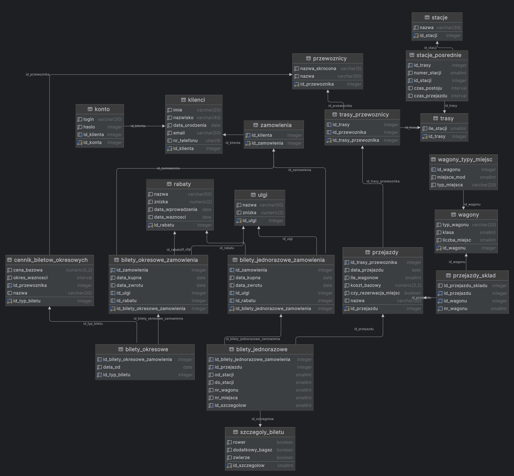

# 1. Tytuł projektu: Koleo − −

# 2. Skład grupy projektowej:

-   Helena Arendacz - grupa 1

-   Jakub Janór - grupa 3

-   Piotr Pasula - grupa 3

# 3. Szczegółowy opis projektu.

Ideą stojącą za projektem jest stworzenie wyszukiwarki połączeń
kolejowych. Ma ona umożliwiać znajdywanie optymalnych tras przejazdu
bazując na preferencjach użytkownika. Wyniki wyszukiwania będą mogły być
sortowane i filtrowane ze wględu na cenę przejazdu, ilość przesiadek,
czas trwania podróży. Aplikacja umożliwi również podgląd dokładnych
informacji dotyczących przejazdu, między innymi kolejnych przystanków na
trasie czy udogodnień oferowanych przez przewoźnika, takich jak wagony
przyjazne dla zwierząt, miejsce na rower lub dodatkowy bagaż. Ponadto
będzie możliwość sprawdzenia ich cen w zależności od wybranych przez
użytkownika zniżek i rabatów. Każda osoba odwiedzająca stronę będzie
mogła utworzyć na niej swój profil umożliwiający zakup i zwrot biletów,
a także dostęp do ich historii oraz wybór domyślnej zniżki. Techniczna
realizacja projektu będzie się opierać na trzech obszarach: GUI,
komunikacja z bazą danych, główna logika programu. Za każdy z nich
będzie odpowiedzialny jeden z członków zespołu. Komunikacja z bazą
danych będzie realizowana przy pomocy interfejsu programowania baz
danych pgJDBC. Dane przesyłane pomiędzy funkcjami programu będą
enkapsulowane w obiekty, dzięki czemu będzie możliwe modułowe rozwijanie
aplikacji. Komunikacja między warstawmi aplikacji będzie odbywała się
przy pomocy interfejsów Javy. Kontrolę nad bazą danych będziemy
sprawować przy pomocy PostgreSQL, która będzie znajdowała się w
repozytorium. Do utworzenia loga oraz niektórych grafik zostanie użyta
sztuczna inteligencja. Do wygenerowania danych o trasach, przejazdach i
użytkownikach zostanie wykorzystany Python.

# 4. Technologie użyte w projekcie: 

-   Główny język programowania: Java

-   Build system: Maven

-   System zarządzania bazą danych: PostgreSQL

-   Biblioteka GUI: JavaFX

-   Framework: Spring(Opcjonalnie)

-   Interfejs programowania bazy danych: pgJDBC

-   Generacja danych do bazy: Python
    
# 5. Schemat bazy danych:

# 6. Link do repozytorium:

<https://github.com/amlq-pl/Koleo-->
